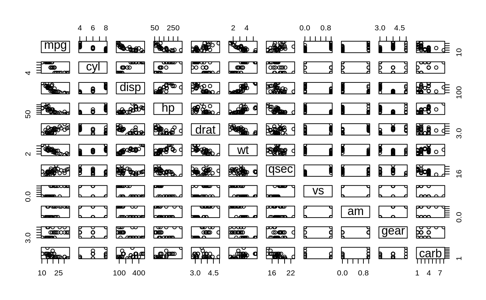

secon 02 FIRT HEADETR
=====================

This is is the second render.

1.  z02Notes
    --------

    Just dilling the ntes space.

<!-- -->

1.  No 02notes.

<pre class='chroma'><code class='language-r' data-lang='r'>#&gt;   Sepal.Length Sepal.Width Petal.Length Petal.Width Species
#&gt; 1          5.1         3.5          1.4         0.2  setosa
#&gt; 2          4.9         3.0          1.4         0.2  setosa
#&gt; 3          4.7         3.2          1.3         0.2  setosa
#&gt; 4          4.6         3.1          1.5         0.2  setosa
#&gt; 5          5.0         3.6          1.4         0.2  setosa
#&gt; 6          5.4         3.9          1.7         0.4  setosa
</code></pre>

